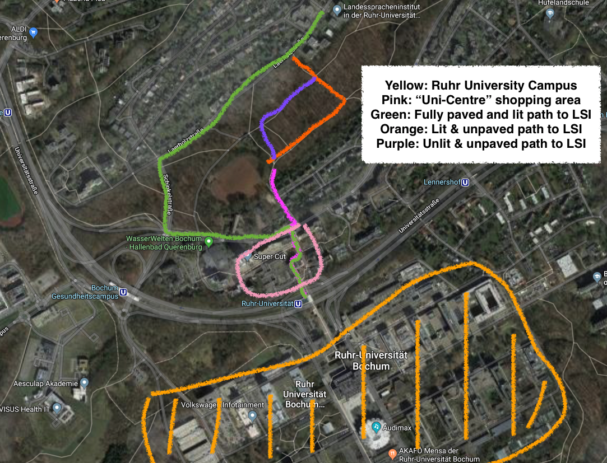

---

layout: wrapper

---

# Directions

German Centre for Cosmological Lensing\\
Astronomisches Institut\\
Ruhr-Universität Bochum\\
Universitätsstr. 150\\
44801 Bochum\\
Germany

## Train travel to Bochum from Düsseldorf airport:
When you arrive at the airport terminal, follow signs for the "SkyTrain" which will take you on 
a short ride (~5min) to the Düsseldorf airport train station.  From there you can catch [regular trains](https://www.bahn.com/en/view/index.shtml) to Bochum
Hauptbahnhof (Hbf; 35-45min).  You can buy your ticket to Bochum from the ticket machine at the SkyTrain station.

On arrival at Bochum Hauptbahnhof, change to the subway U35 (direction Universitat), which runs every 5-15 mins and takes you to Ruhr-Universität (~10min).

## From the U-bahn to the GCCL
The RUB campus is very large, and so GCCL Fellow Angus Wright has made this short video to help you find your way to our building "GAFO"!

<iframe width="560" height="315" src="https://www.youtube.com/embed/V2uK-Wr4zjE" frameborder="0" allow="accelerometer; autoplay; encrypted-media; gyroscope; picture-in-picture" allowfullscreen></iframe>

## Staying at LSI: Landesspracheninstitut
The closest accommodation to the RUB campus is the [LSI](http://www.lsi-bochum.de/wohnen/zimmer-preise.html).  If you don't speak German we can help you to book a room here.   To get to the LSI from the main train station in Bochum take the subway U35 either to the stop
"Ruhr-Universität" or "Bochum - Gesundheitscampus". The former is somewhat
closer but requires a walk over unpaved paths through a park. The latter
allows you to roll your suitcase all the way along "Schinkelstraße" and
"Laerholzstraße".    In the morning you can walk to the GCCL on the main RUB campus following this map:

\\

## Bochum central accommodation
Catherine is an eternal visitor at RUB and uses [airBnB](https://www.airbnb.co.uk/) all the time - there is lots of cheap and good options.   There are also two Hotel Ibis near the train station that are cheap and cheerful.

