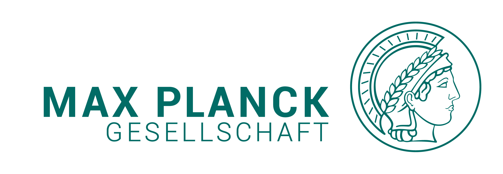
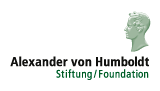

---

layout: wrapper

---

## Welcome to the German Centre for Cosmological Lensing

At the GCCL our long-term goal is to answer one far-reaching question: what is the exact nature of the dark Universe?    We are currently building the methodology and techniques needed to analyse the two major international gravitational lensing surveys of the 2020’s: [LSST](https://www.lsst.org/) and [Euclid](https://www.euclid-ec.org/) in addition to the recently completed [Kilo-Degree Survey](http://kids.strw.leidenuniv.nl).  We are also developing new statistical tools to confront a range of different theories, on both dark matter and dark energy.

The German Centre for Cosmological Lensing (GCCL) was founded in November 2018 through the joint support of the [European Research Council](https://erc.europa.eu/), the [Max Planck Society](https://www.mpg.de/en), [the Alexander von Humboldt Foundation](https://www.humboldt-foundation.de/web/home.html), the [Federal Ministry of Education and Research](https://www.bmbf.de/en/index.html), and the [Deutsche Forschungsgemeinschaft](https://www.dfg.de).   The GCCL is based in the at the Astronomical Institute at the Ruhr-Universität Bochum, with [nodes](/nodes/) at the University of Bonn, the Max-Planck Institute for Astrophysics in Garching, Munich University Observatory, Heidelberg University and the University of Edinburgh.

We have four grant programmes;

- The <a href="apply">GCCL Fellowship programme</a> (Application deadline: Nov 24th 2019)
- <a href="https://docs.google.com/document/d/1pZbdQgodgQAOtL16fKb0mOjHNhjJ37ghTk75q3X-WcA/edit?usp=sharing">Affiliate travel grants</a> (travel between GCCL nodes)
- Workshop and conferences grants (hosted by GCCL nodes)
- <a href="https://docs.google.com/document/d/1ex00yqap5IkKZi044QBNvR9_9Ui59yLeop4b3GYdhEo/edit?usp=sharing">International Distinguished visitor scheme</a> (to any GCCL node)

For further information about any of these schemes, please <a href="contact">contact us</a>.

